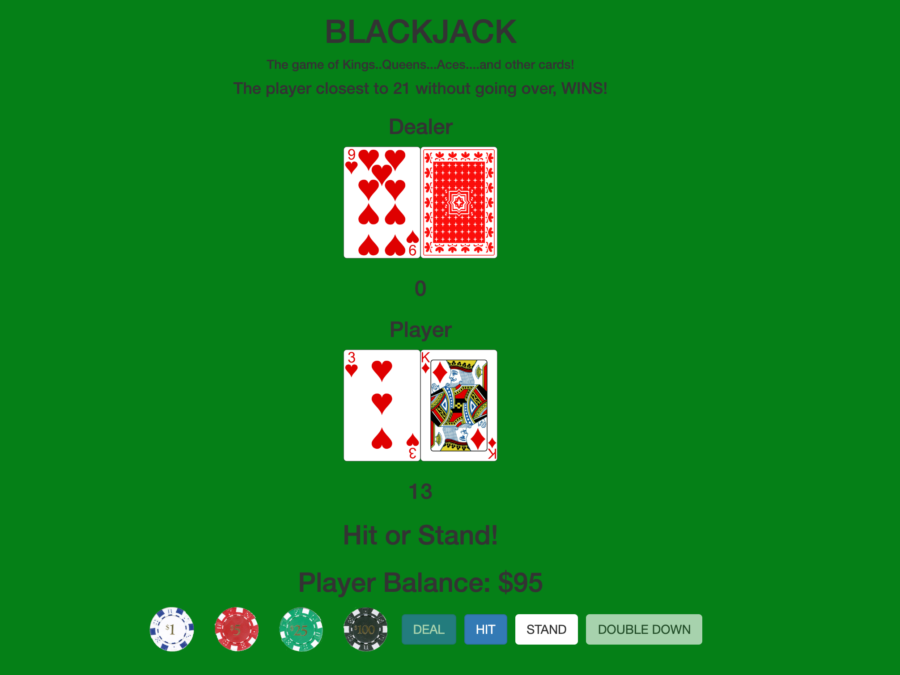
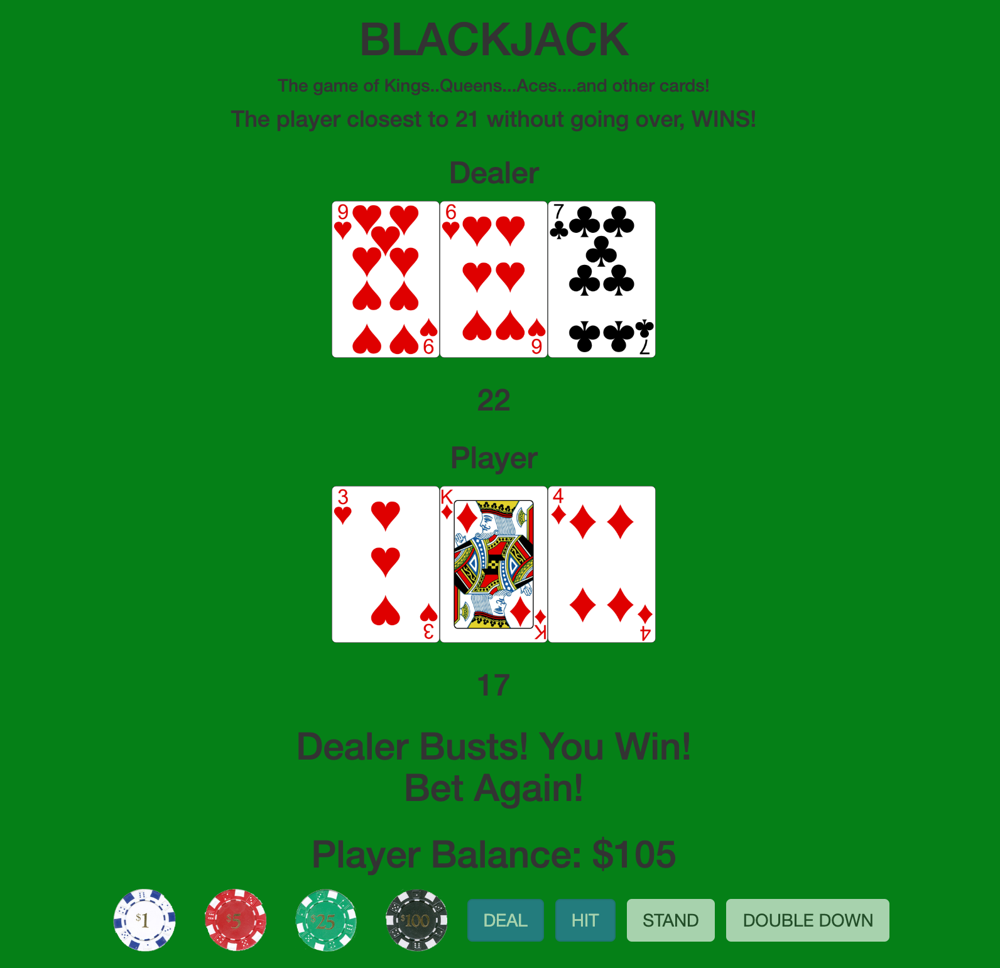
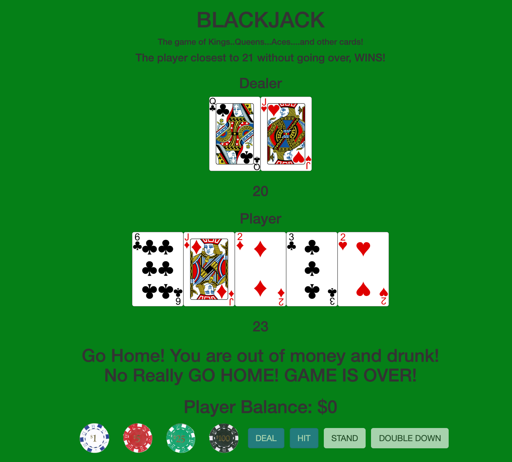

# Blackjack

### A simple blackjack game where the person closest to 21 without going over wins. This uses most of the rules set by Vegas where dealer hits on 16. Double Down is also allowed for this game.

```
SCREENSHOTS:
```







```
TECHNOLOGIES USED:
```
* HTML
* CSS
* Javascript
* Parcel
* Netlify

```
GETTING STARTED:
```
To play use the following link:

[Blackjack Game](https://5dfc0f29c739e901dc41e246--blackjackp1.netlify.com/)

Click on the amount you wish to bet and then deal to get the first hand dealt. After each hand just click on the amount you wish to bet and then deal again to continue playing. The game ends when you run out of money. After each hand the used cards are placed back into the deck and reshuffled to allow for continuous play. For extensive rules and strategy please look at this site;

[Blackjack Rules and Strategy](http://www.hitorstand.net/strategy.php)

A secret alternative version of the game has also bee made and can be found here;

[Breaking Blackjack](https://breaking-blackjack.netlify.com/)

```
FUTURE ENHANCEMENTS:
```
* Add multiple decks
* Add insurance, surrender, and splitting
* Card effects
* Themed decks to use
* The ability to listen to user music through a streaming service; Apple Music, Spotify, Amazon Music, etc.
